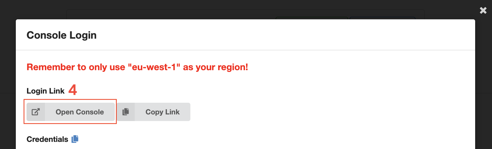
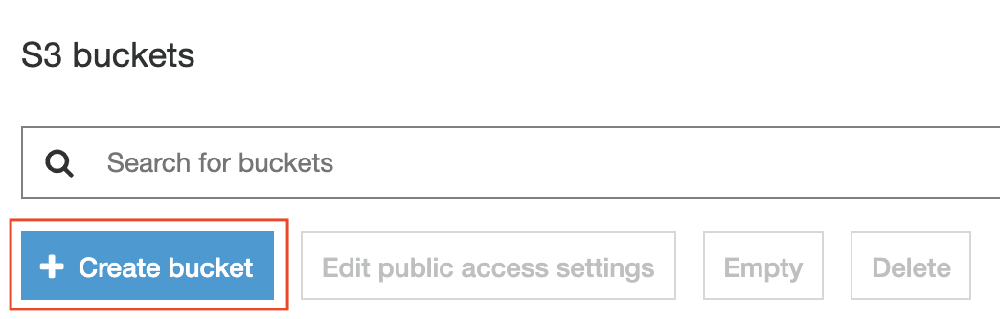
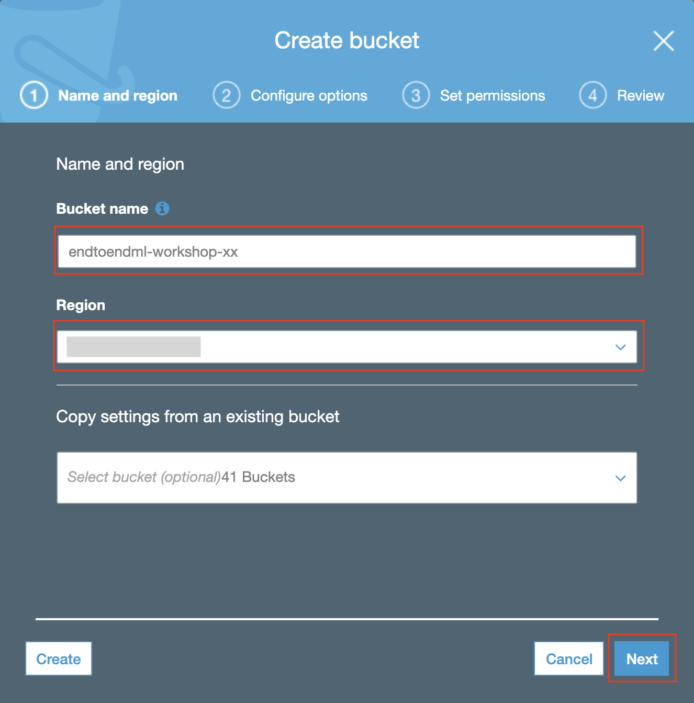
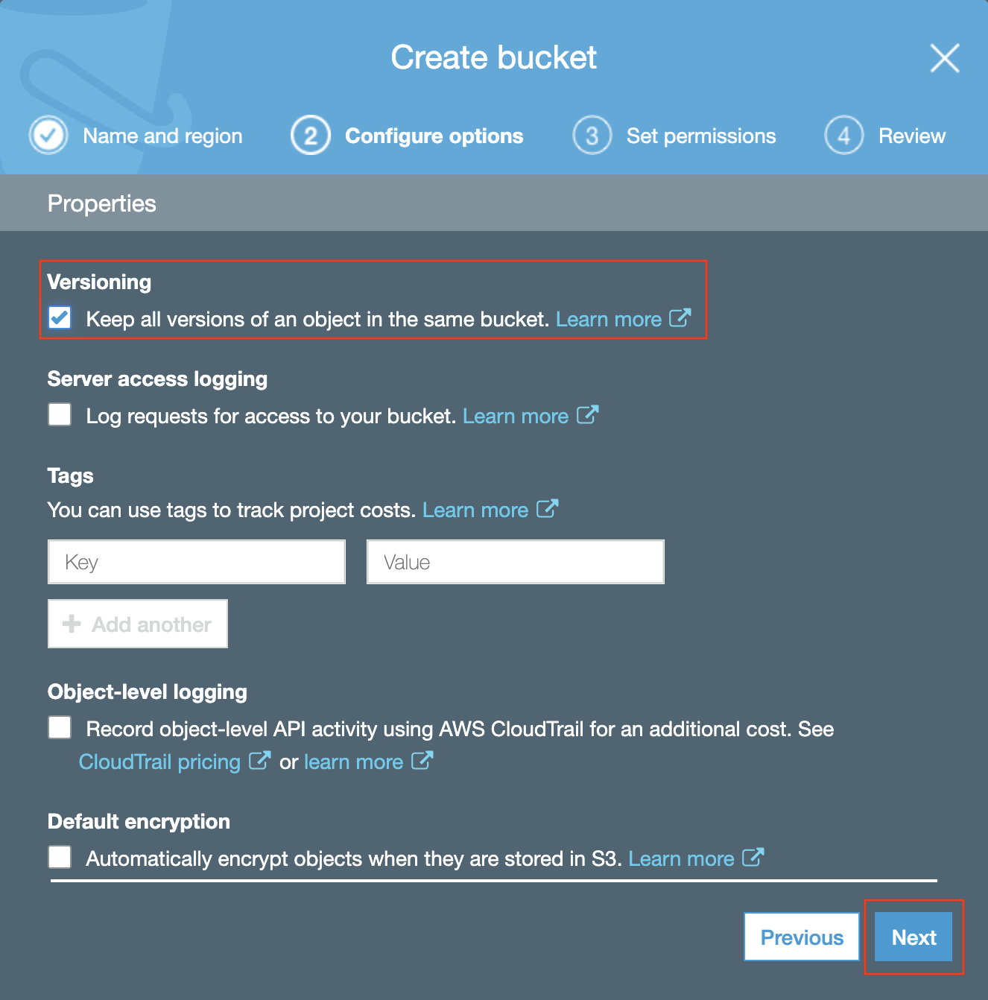

# Create a managed Jupyter Notebook instance with Amazon SageMaker

## Overview

Amazon SageMaker is a fully-managed service that enables developers and data scientists to quickly and easily build, train, and deploy machine learning models at any scale. Amazon SageMaker removes all the barriers that typically slow down developers who want to use machine learning.

Machine learning often feels a lot harder than it should be to most developers because the process to build and train models, and then deploy them into production is too complicated and too slow. First, you need to collect and prepare your training data to discover which elements of your data set are important. Then, you need to select which algorithm and framework you’ll use. After deciding on your approach, you need to teach the model how to make predictions by training, which requires a lot of compute. Then, you need to tune the model so it delivers the best possible predictions, which is often a tedious and manual effort. After you’ve developed a fully trained model, you need to integrate the model with your application and deploy this application on infrastructure that will scale. All of this takes a lot of specialized expertise, access to large amounts of compute and storage, and a lot of time to experiment and optimize every part of the process. In the end, it's not a surprise that the whole thing feels out of reach for most developers.

Amazon SageMaker removes the complexity that holds back developer success with each of these steps. Amazon SageMaker includes modules that can be used together or independently to build, train, and deploy your machine learning models.

In this section, we will walk you through creating a fully-managed Jupyter Notebook instance with Amazon SageMaker, that will be used to execute our experimentation and build the Machine Learning model.

## Create an Amazon S3 bucket
In this section, we will create an Amazon S3 bucket that will be our storage area. Amazon SageMaker and AWS Glue can both use **Amazon S3** as the main storage for both data and artifacts.

1. Sign into the **AWS Management Console** using the Event Engine dashboard at <a href="https://dashboard.eventengine.run" target="_blank">https://dashboard.eventengine.run</a> and **the hashcode provided by the workshop instructors**. [Or access it at <a href="https://console.aws.amazon.com/" target="_blank">https://console.aws.amazon.com/</a> if you are using your own AWS account].

	
	
	
	
	

2. In the upper-right corner of the AWS Management Console, confirm you are in the desired AWS region. For the instructions of these workshop we will assume using the **EU West (Ireland)** [eu-west-1], but feel free to change the region at your convenience.

	> The only constraints for changing AWS region are that we keep consistent the region settings for all services used and services are available in the selected region (please check in case you plan to execute this workshop in another AWS region).

3. Open the **Amazon S3** console by choosing the Amazon S3 service in the menu.
4.	In the Amazon S3 console, click the **Create Bucket** button.
	
	
5.	For the **Bucket Name**, type _endtoendml-workshop-**[your-initials]**_ in the text box and click Next (take note of the bucket name, it will be needed later for loading data in the notebook instance). Press **Next** to move to the next screen.

	> **Note:** if the bucket name is already taken, feel free to add an extra suffix.

	
	
6. Enable versioning of the objects in the bucket as shown in the screen below. This is not required for the workshop, but it is a suggested best practice to ensure consistency and reproducibility of the experimentations.

	

	Press **Next** and then **Next** again leaving the settings as they are in the following screen.
7. Finally, click **Create Bucket** in the Review page.


## Create a managed Jupyter Notebook instance
We are now ready to create an Amazon SageMaker managed Jupyter notebook instance.
An **Amazon SageMaker notebook instance** is a fully managed ML compute instance running the <a href="http://jupyter.org/">**Jupyter Notebook**</a> application. Amazon SageMaker manages creating the instance and related resources. 

1. In the AWS Management Console, click on Services, type “SageMaker” and press enter.
	
	
2. You’ll be placed in the Amazon SageMaker dashboard. Click on **Notebook instances** either in the landing page or in the left menu.
	
	
	
3. Once in the Notebook instances screen, click on the top-righ button **Create notebook instance**.

	
 
4. In the **Create notebook instance** screen

	

	1. Give the Notebook Instance a name like _endtoendml-nb-**[your-initials]**_

	2. Choose **ml.t2.medium** as **Notebook instance type**
	3. In the **IAM role** dropdown list you need to select an AWS IAM Role that is configured with security policies allowing access to Amazon SageMaker, AWS Glue and Amazon S3. The role has been pre-configured for you, so you just need to select **_AmazonSageMaker-ExecutionRole-endtoendml_** in the dropdown list.

	4. Keep **No VPC** selected in the **VPC** dropdown list
	5. Keep **No configuration** selected in the **Lifecycle configuration** dropdown list
	6. Keep **No Custom Encryption** selected in the **Encryption key** dropdown list
	7. Finally, click on **Create notebook instance**

4. You will be redirected to the **Notebook instances** screen and you will see a new notebook instance in _Pending_ state.

	
	
	Wait until the notebook instance is status is _In Service_ and then click on the **Open** button to be redirected to Jupyter.

	
	
	

## Download workshop code to the notebook instance

All the code of this workshop is pre-implemented and available for download from GitHub.

As a consequence, in this section we will clone the GitHub repository into the Amazon SageMaker notebook instance and access the Jupyter Notebooks to build our model.

1. Click on **New > Terminal** in the right-hand side of the Jupyter interface
	
	

	This will open a terminal window in the Jupyter interface
	
	

2. Execute the following commands in the terminal

	```bash
	cd SageMaker/
	git clone https://github.com/giuseppeporcelli/end-to-end-ml-application.git
	```
3. When the clone operation completes, close the terminal window and return to the Jupyter landing page. The folder **end-to-end-ml-application** will appear automatically (if not, you can hit the **Refresh** button)

	
	
4. Browse to the folder **02\_data\_exploration\_and\_feature\_eng** and open the file **02\_data\_exploration\_and\_feature\_eng.ipynb** to start the data exploration, preparation and feature engineering steps.
