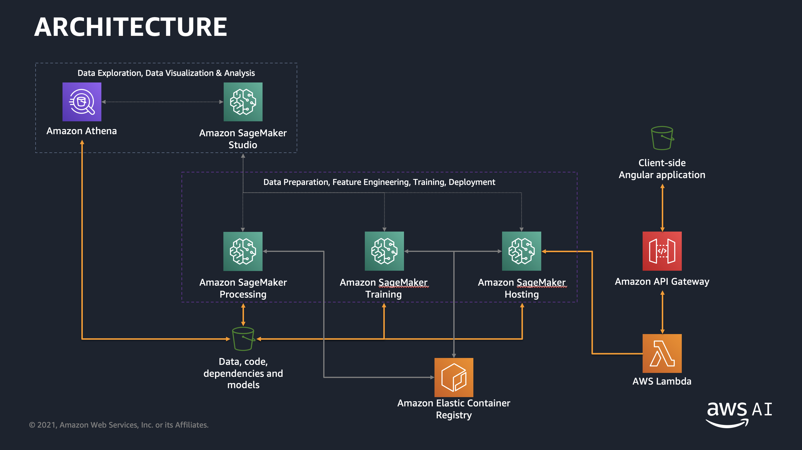

# Build your own Machine Learning application with Amazon SageMaker, AWS Glue and Amazon API Gateway

## Introduction

The Machine Learning process is an iterative process that consists of several steps:

- Identifying a business problem and the related Machine Learning problem
- Data ingestion, integration and preparation
- Data visualization and analysis, feature engineering, model training and model evaluation
- Model deployment and deployed model monitoring and debugging

The previous steps are generally repeated multiple times to better meet business goals following to changes in the source data, decrease in the perfomance of the model, etc.

The process can be represented with the following diagram:

After a model has been deployed, we might want to integrate it with our own application to provide insights to our end users.

In this workshop we will go through the steps required to build a fully-fledged machine learning application on AWS. We will execute an iteration of the Machine Learning process to build, train and deploy a model using Amazon SageMaker and AWS Glue, and then we will add inference capabilities to a demo application by deploying a REST API with Amazon API Gateway.

The final architecture will be:

## The Machine Learning task

We have been provided with a dataset (stored in an Amazon S3 bucket) containing data collected in a wind turbine plant, where each example includes several sensor measurements and a status indicating wheather the plant was healthy or not.

> ⚠️ **Note**: this is a synthetic dataset that oversimplifies the task of doing Predictive Maintenance for the purpose of keeping this workshop easier to execute.

Our goal is building a simple Machine Learning model that, given new sensor data, will predict whether the plant requires maintenance or not, allowing to execute maintenance before a breakdown event happens (<b>Predictive Maintenance</b>).

Following is an excerpt from the dataset:

|turbine\_id|turbine\_type|wind\_speed|rpm\_blade|oil\_temperature|...|breakdown|
|-------|-------|-------|-------|-------|-------|-------|
|TID003|HAWT|85|78|36.0|...|yes|
|TID009|HAWT|80|25|37.0|...|no|
|TID005|HAWT|36|32|40.0|...|no|

Our target variable is the **breakdown** attribute, which is binary and suggests implementing a binary classification model.

After building the model, we will have to host it and expose as a REST API for executing inferences from client-side applications.

## Modules

This workshops consists of six modules:

- <a href="01_create_notebook_instance/">**Module 01**</a> - Creating an Amazon SageMaker managed Jupyter notebook instance and an Amazon S3 bucket that will be used for storing data, models and code. 
- <a href="02_data_exploration_and_feature_eng/">**Module 02**</a> - Using AWS Glue and Amazon Athena to execute data preparation and data exploration, and then feature engineering using SparkML.
- <a href="03_train_model/">**Module 03**</a> - Training a binary classification model using Amazon SageMaker built-in XGBoost algorithm, that will predict whether a wind turbine plant requires maintenance.
- <a href="04_deploy_model/">**Module 04**</a> - Deploying the feature engineering and ML models as a pipeline using Amazon SageMaker hosting.
- <a href="05_API_Gateway_and_Lambda/">**Module 05**</a> - Buiding a REST API using Amazon API Gateway and implementing an AWS Lambda function that will invoke the Amazon SageMaker endpoint for inference.
- <a href="06_invoke_API/">**Module 06**</a> - Using a single-page demo application to invoke the REST API and get inferences.

You must comply with the order of modules, since the outputs of a module are inputs of the following one.

## Getting started

This workshop has been designed assuming that each participant is using an AWS account that has been provided and pre-configured by the workshop instructor(s). However, you can also choose to use your own AWS account, but you'll have to execute some preliminary configuration steps as described <a href="setup/">here</a>.

Once you are ready to go, please start with <a href="01_create_notebook_instance/">**Module 01**</a>.

## License

The contents of this workshop are licensed under the [Apache 2.0 License](./LICENSE).

## Authors

[Giuseppe A. Porcelli](https://it.linkedin.com/in/giuporcelli) - Principal, ML Specialist Solutions Architect - Amazon Web Services EMEA 
[Antonio Duma](https://it.linkedin.com/in/antoniod82) - Solutions Architect - Amazon Web Services EMEA